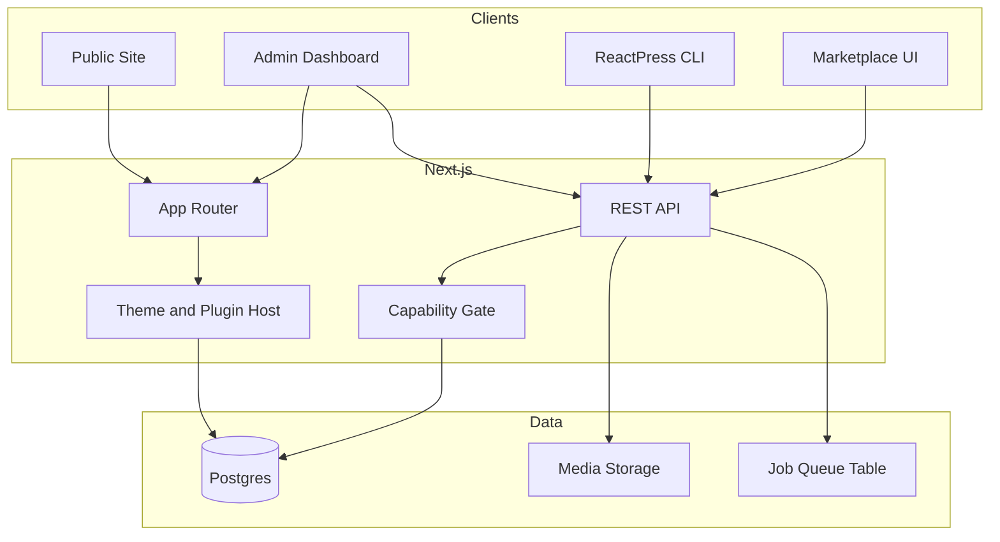

# ReactPress — Full Platform Features & Build Guide

## Product overview

**ReactPress** is a WordPress-like CMS and platform built in React/Next.js. One product includes:

- Public website (theme-rendered)
- Admin dashboard (`/admin`)
- REST API (`/api`)
- Theme system + Customizer
- Plugin system (hooks/filters)
- Multisite (network admin)
- CLI tooling
- Theme/plugin marketplace (own registry)
- Import/export (ReactPress JSON + WordPress WXR)

## Tech stack

| Layer  | Choice                                     |
| ------ | ------------------------------------------ |
| App    | Next.js App Router + TypeScript + Tailwind |
| DB     | Postgres + Prisma                          |
| Auth   | NextAuth (credentials + session cookies)   |
| Editor | Block editor storing JSON block tree       |
| Media  | Local disk first; S3-compatible later      |
| Jobs   | DB-backed job table for schedule/publish   |
| CLI    | Node package `reactpress` calling the API  |

## Architecture



**Request flow (content):** Admin or CLI → REST → capability check → Prisma → Postgres. Public pages resolve active theme templates → load post/page by slug scoped to current site → render blocks.

**Multisite:** Every content row has `siteId`. Middleware resolves site from domain or path prefix before queries run.

## Feature map

### Content

- Posts, pages, custom post types
- Draft / publish / private / trash / schedule
- Revisions + autosave
- Categories, tags, custom taxonomies
- Permalinks + full-text search

### Media & discussion

- Media library (upload, crop meta, attach)
- Comments + moderation queue

### Site structure

- Nav menus + locations
- Widget areas + widgets
- Site settings (title, tagline, homepage, reading)

### Editor & admin

- WP-style admin shell
- Block editor + classic text fallback
- List tables with bulk actions
- Dashboard home

### Users

- Roles + capabilities (Administrator, Editor, Author, Contributor, Subscriber + custom)
- Super Admin for multisite

### Themes

- `theme.json` + React template components
- Template hierarchy (index, home, single, page, archive, search, 404)
- Template parts (header, footer)
- Customizer + live preview

### Plugins

- `plugin.json` + register entry
- Actions / filters bus
- Activate / deactivate / settings screens
- Documented sandbox (allowed APIs only)

### Multisite

- Network + sites
- Path or domain mapping
- Network admin + per-site admin
- Shared users, per-site content/media

### Platform

- Public + authenticated REST
- CLI (user, post, plugin, theme, export, import)
- Webhooks
- Marketplace catalog + install from registry URL
- Export/import ReactPress JSON
- WordPress WXR import
- Backup / restore dump

## Suggested repo layout

```
reactpress/
  app/                 # Next.js App Router (public, admin, api)
  components/          # shared UI
  lib/                 # prisma, auth, caps, hooks, jobs
  prisma/              # schema + migrations
  themes/              # installed / default themes
  plugins/             # installed / default plugins
  packages/cli/        # ReactPress CLI
  features.md          # this product guide
  instruction.txt      # short step checklist
```

## Build steps

Each step: do this → done when.

### Phase A — Foundation

step 1, ✅ Create Next.js App Router project with TypeScript and Tailwind → app runs locally
step 2, ✅ Add Postgres and Prisma; create base schema file → `prisma migrate` works
step 3, ✅ Add User, Session, Account models and NextAuth credentials login → can log in
step 4, ✅ Create route shells for `/`, `/admin`, `/api/health` → three areas load
step 5, ✅ Add Role + Capability tables and `can(user, cap)` helper → unauthorized admin routes redirect
step 6, ✅ Add Site model and request site resolver (single-site first) → all queries take `siteId`

### Phase B — Content core

step 7, ✅ Build Post model and admin CRUD API (title, slug, status, content JSON) → create/edit/list/delete posts
step 8, ✅ Build Page model and CRUD same as posts → pages work independently
step 9, ✅ Add Revision model and autosave endpoint → can restore an older revision
step 10, ✅ Add scheduled status + job runner that publishes due posts → schedule works without manual publish
step 11, ✅ Add Category and Tag taxonomies linked to posts → filter posts by term
step 12, ✅ Add CPT and custom taxonomy registry (DB + code registration) → register a type and CRUD it
step 13, ✅ Build Media model, upload API, and library UI → upload and attach media to posts
step 14, ✅ Build Comment model, public form, admin moderate (approve/spam/trash) → comments flow works
step 15, ✅ Build Menu + MenuItem models and menu editor UI → assign menu to a location
step 16, ✅ Build WidgetArea + Widget models and widgets screen → add/remove widgets per area
step 17, ✅ Build Settings store (key/value per site) for title, tagline, homepage, permalinks → settings save and apply
step 18, ✅ Add Postgres full-text search on posts/pages → search returns ranked results

### Phase C — Editor and admin UX

step 19, ✅ Build admin chrome (sidebar, top bar, screen header) matching CMS patterns → all admin pages share layout
step 20, ✅ Build block editor that reads/writes block JSON → publish stores blocks, public renders them
step 21, ✅ Build list tables for posts/pages/media with filters, search, bulk actions → bulk trash/publish works
step 22, ✅ Build media picker modal reusable from the editor → insert image into a block
step 23, ✅ Build admin dashboard (at a glance, activity, quick draft) → dashboard is the admin home

### Phase D — Themes

step 24, ✅ Define theme package format (`theme.json`, templates folder, assets) → document author rules
step 25, ✅ Ship a default theme and theme install/activate API → switching theme changes public site
step 26, ✅ Implement template hierarchy resolver → correct template for home/single/page/archive/404
step 27, ✅ Support template parts (header/footer) editable via theme → parts render on all pages
step 28, Build Customizer (logo, colors, menus, homepage) with draft + publish → preview before go-live
step 29, Add theme file editor or template override list for power users → can override one template per site

### Phase E — Plugins

step 30, Define plugin package format (`plugin.json`, `register.ts`) → document author rules
step 31, Build actions/filters hook bus in `lib/hooks` → plugin can `addAction` / `addFilter`
step 32, Build plugin install, activate, deactivate, delete → active plugins load on boot
step 33, Allow plugins to register admin menu pages and settings → plugin settings screen works
step 34, Document and enforce sandbox (DB via APIs, no raw fs outside upload dir) → unsafe paths blocked

### Phase F — Multisite

step 35, Add Network model; support many Sites under one network → create a second site
step 36, Build Network Admin UI (sites, users, network plugins/themes) → super admin can manage network
step 37, Scope posts, pages, media, menus, settings by `siteId` → site A cannot read site B content
step 38, Add Super Admin flag and per-site role membership → caps differ by site
step 39, Resolve site by domain or `/site-slug` path in middleware → correct site serves public pages

### Phase G — Platform APIs and CLI

step 40, Ship public REST for posts, pages, media, taxonomies, users (read rules) → unauthenticated read works where allowed
step 41, Ship authenticated admin REST mirroring WP-style resources → CLI and admin share API
step 42, Build `packages/cli` with login, scaffold, user, plugin, theme, export commands → CLI can create a post
step 43, Add webhooks on post publish/update/delete → outbound HTTP fires on events

### Phase H — Marketplace and portability

step 44, Build marketplace catalog UI reading a registry JSON/API → browse themes and plugins
step 45, Install theme/plugin from registry URL into `themes/` or `plugins/` → one-click install activates
step 46, Export and import full site as ReactPress JSON → round-trip a site
step 47, Import WordPress WXR (posts, pages, categories, media URLs) → WP content lands in ReactPress
step 48, Backup and restore site dump (DB subset + media zip) → restore brings site back

### Phase I — Harden and ship

step 49, Seed demo site (admin user, sample posts, default theme, sample plugin) → fresh install looks alive
step 50, Add tests for capabilities, CPT registration, and multisite isolation → CI catches leaks
step 51, Configure production deploy (Node/Next host, managed Postgres, media bucket) → staging URL works
step 52, Write author docs: theme handbook, plugin handbook, REST reference, CLI reference → external builders can extend

## Out of scope

- Running existing PHP WordPress plugins or PHP themes as-is
- Bit-identical Gutenberg / WP admin UI clone
- Hosting WordPress.org’s entire plugin directory (own registry format instead)
- WooCommerce-level commerce (can come later as a plugin)

## Success criteria

ReactPress is “full platform” when a user can: publish content with the block editor, switch themes, install a plugin that hooks content, run a second site on the network, call REST/CLI, install from the marketplace, and import from WordPress WXR.
